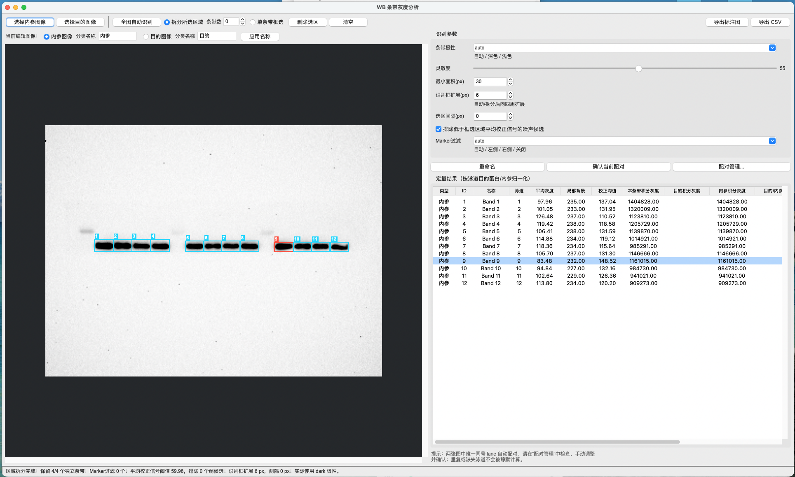

# WB 条带灰度分析软件

这是一个本地运行的 Python GUI 软件，用于 Western blot（WB）条带识别、手工选区、背景校正和灰度定量。

## 软件界面



## 功能

- 分别选择内参图像和目的图像，支持 PNG、JPEG、TIFF、BMP
- 可在“当前编辑图像”旁分别填写内参和目的蛋白的分类名称；应用后结果表、状态提示、标注图文件名和 CSV 分类字段同步更新
- 两张图独立保留选区，并按 lane 自动配对目的蛋白与内参条带
- 对唯一同号 lane 自动计算 `target_integrated_density / reference_integrated_density`
- 配对管理窗口支持逐条确认、跨 lane 手动调整、手动取消和恢复自动配对
- 重复 lane、缺失目的条带、缺失内参条带、内参积分灰度为 0 等情况会明确显示状态和原因，不会静默产生比值
- 自动判断深色/浅色条带，也可以手工指定极性
- 全图自动识别，支持灵敏度和最小面积调节
- 全图识别会按条带行估计典型宽度，并对确认包含多个灰度峰的异常宽框执行分峰
- 全图识别会复核同排窄碎片：仅合并距离异常近且峰间无明显灰度谷值的候选，并统一同排选框高度与典型宽度
- 全图识别会对每个候选行执行整排横向投影复核，将谷底仍明显高于背景的纹理双峰合并，避免曝光纹理或上方拖尾重复计为条带
- 拆分所选区域：框住一排或一块区域，自动拆分为多个独立条带
- “拆分所选区域”旁可输入条带数：`0` 表示自动判断，正整数表示按指定数量强制辅助拆分；指定数量时会保留弱峰且不再执行 Marker/弱候选自动删减
- 指定数量拆分会检查框外上下文：排除与框外 Marker 连续的截断拖尾，同时保留靠近边缘但具有独立峰强度的真实第一条带
- 指定数量模式会联合评价整组峰的显著性、横向覆盖和泳道间距，避免一个宽条带的内部双峰挤掉远端弱条带
- 区域拆分优先复用全图识别的完整条带框，避免小区域背景估计导致条带碎片化
- 可调“识别框扩展”同时作用于全图识别和区域拆分，让 ROI 完整覆盖条带并限制其跨入相邻泳道
- 相邻区域拆分框以中心中点分界，并保留可调背景间隔，避免 ROI 重叠、粘连和像素重复定量
- 扩展完成后执行同排几何校验，即使泳道聚类异常也不会输出横向重叠的 ROI
- 同排候选自动统一上下边界，避免较弱或轻微错位的首个条带只框住局部核心
- 区域横向信号投影用于自适应分行：修正轻微偏移的首条带，同时避免复杂上下层信号合并成竖长框
- 区域识别合并全图、局部上下文和增强灵敏度三组候选，补回全图阈值漏掉的浅条带
- 单排横向投影先保留近距离候选峰，再按峰间谷深区分真实双条带与单条带内部起伏，并用核心信号保留被背景边距稀释的浅条带
- 区域自动拆分会结合整排泳道间距和未平滑原始投影复核异常近的双峰，合并单条带内部深色双峰，同时保留确实回到底噪的近邻双条带
- 大图预览、自动极性和全图候选会复用缓存；水平区域优先走快速投影拆分，避免切图或重复框选时反复执行整图与二维局部扫描
- 可勾选“排除低于框选区域平均校正信号的噪声候选”（默认启用）
- Marker过滤支持自动、左侧、右侧和关闭；同时用于全图识别与区域拆分
- 单条带框选：鼠标拖出单个条带 ROI
- 删除、清空、重命名条带并自动分配泳道编号
- 图像画布中可左键选中 ROI，右键直接重命名或删除
- 使用 ROI 周围的局部背景环进行背景校正
- 结果表同时显示目的积分灰度、内参积分灰度、目的/内参比值、配对状态和缺失原因
- 导出按配对关系组织的 CSV，包含两侧完整坐标、定量指标和配对诊断字段（Excel 可直接打开）
- 导出带选区编号和名称的标注图

## 打开 GUI（macOS 和 Windows）

### macOS

首次使用时，双击 `MACOS-1-安装依赖.command`。脚本会检测 Python；未安装合适版本时会通过 Homebrew 自动安装 Python 3.12 和 Tkinter，然后创建项目虚拟环境并安装依赖。

安装完成后，双击 `MACOS-2-启动WB分析.command` 打开 GUI，也可以在项目目录运行：

```bash
.venv/bin/python run_wb.py
```

如果系统提示脚本没有执行权限，先运行：

```bash
chmod +x MACOS-1-安装依赖.command MACOS-2-启动WB分析.command
```

### Windows

首次使用时，双击 `WINDOWS-1-安装依赖.bat`。脚本会检测 Python；未安装合适版本时会自动安装 Python 3.12，然后创建项目虚拟环境并安装依赖。

安装完成后，双击 `WINDOWS-2-启动WB分析.bat` 打开 GUI。

也可以在项目目录的 PowerShell 或命令提示符中手动运行：

```bat
py -3 -m pip install -r requirements.txt
py -3 run_wb.py
```

如果系统没有 `py` 命令，将以上 `py -3` 改为 `python`。更完整的 Windows 排错说明见 [`WINDOWS.md`](WINDOWS.md)。

成功启动后会显示标题为“WB 条带灰度分析”的 GUI 主窗口。

## 推荐操作流程

1. 按上方对应系统的方式打开 GUI，确认出现“WB 条带灰度分析”主窗口。

2. 分别点击“选择内参图像”和“选择目的图像”。

3. 使用图像上方的“当前编辑图像”在内参和目的图像之间切换；两张图的选区互相独立。可在两个“分类名称”输入框中填写如 `GAPDH`、`AKT`，按回车或点击“应用名称”，结果表“类型”列会同步显示。

4. 条带极性先保持 `auto`；全图较干净时点击“全图自动识别”。

5. 识别太少时提高灵敏度，误识别多时降低灵敏度或提高最小面积，然后再次识别。

6. 选择“拆分所选区域”并框住整排，软件会为每个条带建立独立 ROI。选区上下应保留少量背景。“条带数”保持 `0` 时自动判断；已知数量时输入正整数，可强制按该数量拆分近邻或浅条带。
   如果识别框没有完整覆盖条带，可增大“识别框扩展(px)”后重新框选；默认值为 6 px。
   “选区间隔(px)”控制相邻框之间额外保留的背景，默认 0 px；需要明显空隙时再调大。
   默认以整个框选区域（包含背景）的平均校正信号为阈值，只排除接近背景的噪声候选，避免误删正常弱条带；取消勾选可保留全部候选。
   区域拆分同时运行全图、局部与增强灵敏度识别：重叠时保留完整全图框，不重叠的浅条带会作为新候选补入。
   Marker通常位于图像边缘且包含纵向堆叠片段，默认 `auto` 会自动排除；若仍有残留，可明确选择 `left` 或 `right`，没有Marker时选择 `off`。

7. 用“单条带框选”补充不规则条带。

8. 结果表中的“类型”列标明内参或目的；点击任意结果行会自动切换到对应图像。唯一同号 lane 会自动配对并立即显示目的/内参比值。

9. 点击“配对管理…”逐条检查结果。自动关系正确时可点击“确认当前配对”；若两张图的 lane 编号没有对齐，可为目的条带手动选择任意内参条带。

10. 重复 lane 或缺失条带会显示原因。修正 ROI 后可恢复自动配对，也可以保留手工关系；同一个内参条带不能同时归一化多个目的条带。

11. 在结果表中选择错误条带并删除；双击表格行可以重命名。

12. “导出 CSV”会按每个目的/内参配对导出；缺失的一侧保留为空，并写入 `pairing_status` 和 `missing_reason`。“导出标注图”导出当前编辑图像。
